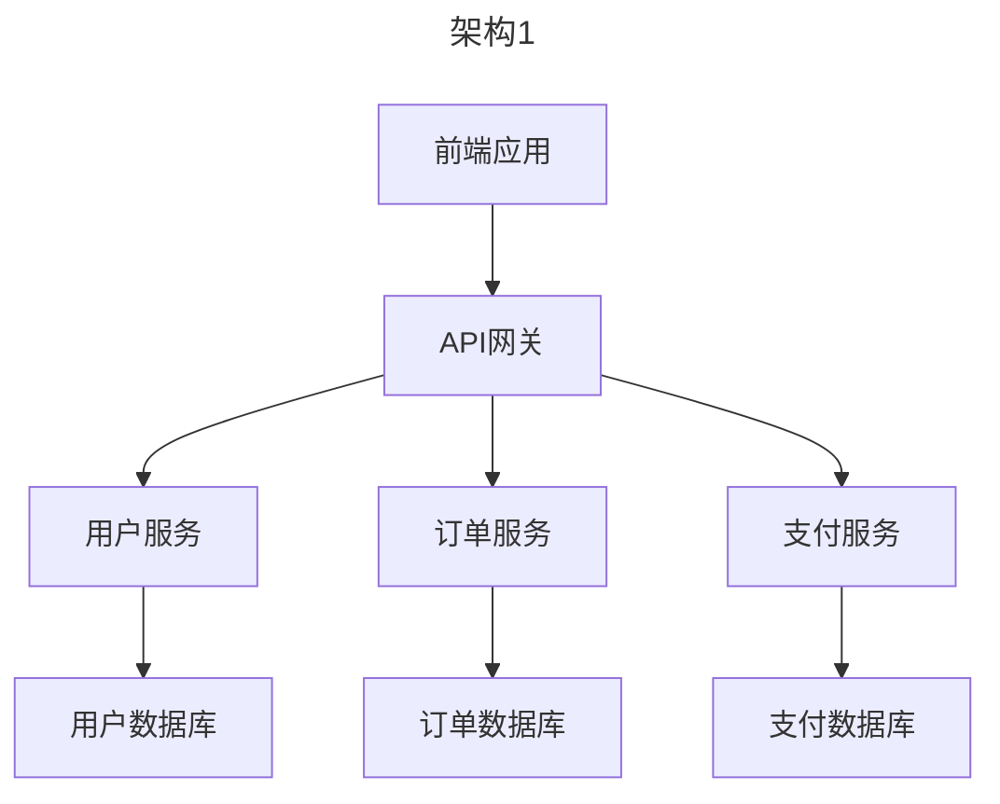
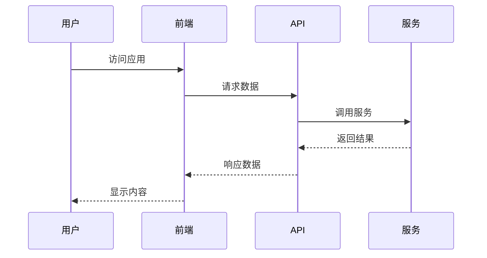
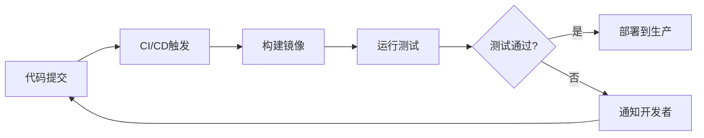
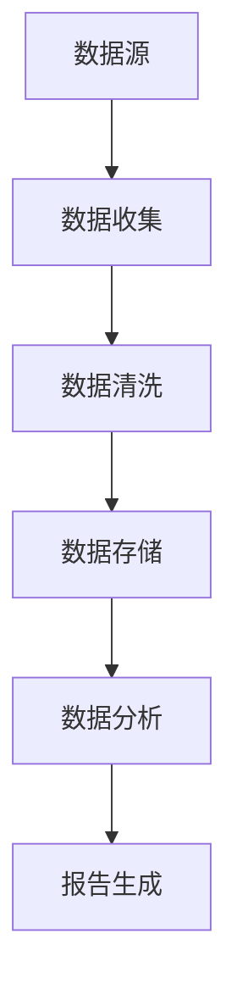

# 项目文档

这是一个项目的文档文件，包含一些流程图。

## 系统架构

系统的整体架构如下：

```mermaid
---
title: 架构1
---
graph TB
A[前端应用] --> B[API网关]
B --> C[用户服务]
B --> D[订单服务]
B --> E[支付服务]
C --> F[用户数据库]
D --> G[订单数据库]
E --> H[支付数据库]
```

## 用户流程

用户使用系统的基本流程：

```mermaid
sequenceDiagram
    participant U as 用户
    participant F as 前端
    participant A as API
    participant S as 服务
    
    U->>F: 访问应用
    F->>A: 请求数据
    A->>S: 调用服务
    S-->>A: 返回结果
    A-->>F: 响应数据
    F-->>U: 显示内容
```

## 部署流程

```mermaid
graph LR
    A[代码提交] --> B[CI/CD触发]
    B --> C[构建镜像]
    C --> D[运行测试]
    D --> E{测试通过?}
    E -->|是| F[部署到生产]
    E -->|否| G[通知开发者]
    G --> A
```

## 数据流

```mermaid
flowchart TD
    A[数据源] --> B[数据收集]
    B --> C[数据清洗]
    C --> D[数据存储]
    D --> E[数据分析]
    E --> F[报告生成]
```